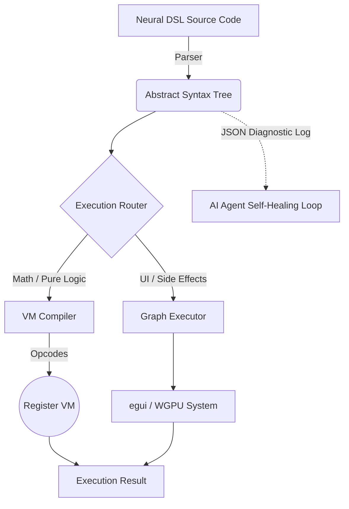

# KnotenCore 🦀🤖

[](https://github.com/holgerbaer-bl/KnotenCore)
[](https://github.com/holgerbaer-bl/KnotenCore/actions/workflows/ci.yml)

*(Noun) /knoːtən kɔːr/*

1. **Not** a relentless underground German hardcore techno subgenre. 
2. A blazing-fast, thread-safe, and deterministic **AI-Native Execution Runtime** — agents feed it structured JSON logic, the AOT compiler turns it into flat bytecode, and the Stack-VM executes it at bare-metal speed. No browser. No GC. No surprises.

*(Please leave your glowsticks at the door before compiling).*

**The Deterministic AI-Native Execution Runtime.**

## What is KnotenCore?
**KnotenCore** is a **Deterministic AI-Native Execution Runtime** built entirely in Rust. External AI agents describe programs as structured **JSON-AST nodes** (`.nod` files). The engine compiles these directly into an AOT-optimized flat bytecode stream and executes them on a Register Stack-VM — achieving deterministic, GC-free, bare-metal performance without any intermediate browser or script-engine layer. WGPU-based rendering functions as the **Physical Representation Layer**, allowing agents to express 3D scenes, audio, and UI as pure data — not imperative draw calls.

### Why "KnotenCore"?
**Knoten** is the German word for **Node**. The runtime is architecturally a highly-efficient graph of Abstract Syntax Tree (AST) *nodes* — the fundamental unit of computation that AI agents author and the engine deterministically evaluates. **Core** represents the blazingly fast, bare-metal Rust execution environment that processes these nodes via AOT compilation into a flat opcode stream.

---

## 🤖 AI-Readiness Foundation (Sprints 121–125)

KnotenCore is purpose-built for autonomous AI agents. Every node and native function is formally specified and machine-validated:

| Artifact | Path | Purpose |
|----------|------|---------|
| **EBNF Grammar** | [`docs/LANGUAGE_REFERENCE/nod_grammar.ebnf`](docs/LANGUAGE_REFERENCE/nod_grammar.ebnf) | Normative structural grammar of every `.nod` JSON node. Eliminates ambiguity for LLM code generation. |
| **JSON Schema** | [`docs/LANGUAGE_REFERENCE/node_types.json`](docs/LANGUAGE_REFERENCE/node_types.json) | Full Draft-07 JSON Schema with `additionalProperties: false` on every object node. **Hallucinated fields are rejected at runtime.** |
| **Function Registry** | [`docs/LANGUAGE_REFERENCE/native_functions.json`](docs/LANGUAGE_REFERENCE/native_functions.json) | Machine-readable registry of every native FFI function (30+), with parameter types, return types, required permissions, and live AST call examples. |
| **Anti-Pattern Guide** | [`docs/LANGUAGE_REFERENCE/examples/99_antipatterns.nod`](docs/LANGUAGE_REFERENCE/examples/99_antipatterns.nod) | 10 explicit DO/DON'T patterns for AI agents covering wrong node names, bare scalars, hallucinated functions, and ExternCall misuse. |
| **Error Catalog** | [`docs/LANGUAGE_REFERENCE/error_catalog.json`](docs/LANGUAGE_REFERENCE/error_catalog.json) | Registry of execution fault codes and self-healing hints for AI agents. |
| **Self-Healing Validator** | `--output-format json` | CLI flag hardening AST evaluation blocks dynamically intercepting syntax faults, emitting strict JSON structs mapping recovery context loops back to generative agents. |
| **AI Agent Guide** | [`llm.md`](llm.md) | Routing document directing agents to the authoritative references above and documenting all engine constraints. |

> **For AI Agents:** Read `native_functions.json` and `99_antipatterns.nod` before generating any `.nod` code. Always validate output against `node_types.json`.

---

## 🎯 AI-Readiness Benchmark (Sprint 126/127) — AG Baseline: 20/20

KnotenCore is the **first DSL project with a public, reproducible AI-Readiness Score** —
measuring how reliably external LLMs generate correct `.nod` programs without human correction.

| Score | Threshold |
|-------|-----------|
| **AG (Antigravity)** | **100% — 20/20 ✅**  Benchmark Leader |
| < 60% | Not AI-Ready |
| 60–79% | Basic AI-Ready |
| 80–89% | Productive AI-Ready |
| 90%+ | Benchmark Leader ← Target Reached |

The AG agent used **only `llm.md` + `node_types.json` + `native_functions.json`** as context
(no Rust source). See [`benchmark/results/ag_baseline.md`](benchmark/results/ag_baseline.md) for the full
per-task breakdown and self-healing analysis.

> **Test your model:** Clone → prompt with the 3 docs → run `benchmark/validator.sh`
> → submit your score via PR to `benchmark/results/`.

---

## ⏱️ Performance Benchmarks (Sprint 128)

KnotenCore features a dual JIT/AOT engine architecture. Following our milestone achieving 100% VM execution capabilities, we successfully validated the Bare-Metal performance of the stack machine runtime.

On a computationally demanding 1,000,000 algorithmic loop constraint using the Leibniz pi estimation natively encoded heavily with Float primitives (`Mul`, `Add`, `Div`, `While`, `Assign`), tests generated via `bench_knc` resulted in:

- **JIT Evaluator:** ~1914 ms
- **AOT Stack VM:** ~1580 ms

**Speedup factor:** **1.21x** natively faster out-of-the-box using the Register VM, significantly reducing deep recursive AST frame lookup overhead.

---

## 🔬 Boolean Algebra & Comparison Operators (Sprint 125)

A complete set of native logical and relational operators is now available in the JSON-AST. These compile to dedicated AOT Bytecode (`LessEqual`, `GreaterEqual`, `NotEqual`, `And`, `Or`, `Not`) for maximum performance.

| Node | Operator | Example JSON-AST |
|------|----------|-----------------|
| `Lte` | `<=` | `{"Lte": [{"Identifier": "x"}, {"IntLiteral": 10}]}` |
| `Gte` | `>=` | `{"Gte": [{"Identifier": "score"}, {"IntLiteral": 100}]}` |
| `NotEq` | `!=` | `{"NotEq": [{"Identifier": "state"}, {"StringLiteral": "idle"}]}` |
| `And` | `&&` | `{"And": [{"BoolLiteral": true}, {"BoolLiteral": false}]}` |
| `Or` | `\|\|` | `{"Or": [{"BoolLiteral": false}, {"BoolLiteral": true}]}` |
| `Not` | `!` | `{"Not": {"BoolLiteral": true}}` |

---

## Runtime Architecture

KnotenCore is a **hybrid JIT/AOT execution runtime**. The agent authors a JSON-AST program; the engine selects the optimal execution path automatically:

```
JSON-AST (.nod)  →  Parser  →  AST (Node enum)
                                  │
                    ┌─────────────┴─────────────────┐
                    │                               │
             JIT Executor                   AOT VM Compiler
          (side-effects, UI)            (pure math, loops)
                    │                               │
             egui / WGPU                  Flat Opcodes
        (Physical Repr. Layer)          Stack-VM (ALU)
```

| Module | Role |
|---|---|
| `src/executor.rs` | **Coordinator & State-Holder** — JIT path; routes nodes, holds permissions & world state |
| `src/vm/compiler.rs` | **AOT Compiler** — Transforms pure-computation AST subtrees into a flat opcode stream |
| `src/vm/machine.rs` | **Stack-VM / ALU** — Executes flat bytecode at bare-metal speed; no GC, no allocations in the hot path |
| `src/audio.rs` | **Audio Engine** — Thread-safe bare-metal sound pipeline via `rodio`; decoupled from the render loop |
| `src/bin/knoten_lsp.rs` | **Language Server (LSP)** — `tower-lsp` server exposing real-time `.nod` validation and OpCode-awareness to editors & agents |
| `src/window.rs` | **Physical Representation Layer** — winit event-loop + WGPU rendering; receives `RenderCommand` messages from the executor |
| `src/async_bridge.rs` | **Nervous System** — Non-blocking `Fetch` and `Extract` via background worker threads |

---

## Key Features

### 🔒 Thread-Safe & Sandboxed
KnotenCore is built for AI-driven execution with strict, audited security:
- **True Zero Warnings**: The engine complies with mathematical strictness — `cargo clippy --lib` yields precisely 0 warnings, ensuring architectural purity and complete VM stack safety.
- **Deny-by-Default** policy for all I/O. All permissions must be explicitly granted via CLI flags.
- **`--allow-read`**: Enables `FSRead`, `IO.ReadFile`, and `registry_read_file`. Paths are canonicalized and verified against the working directory to prevent path-traversal attacks.
- **`--allow-write`**: Enables `FSWrite`, `IO.WriteFile`, and `registry_write_file`. Write targets are normalized and boundary-checked.
- **`--allow-network`**: Enables `Node::Fetch` and all outbound HTTP calls.
- **`ExternCall Protection`**: FFI bridge calls pass through the same sandbox rule-set as standard nodes — there is no bypass.
- **`Structured Faults`**: Unauthorized access returns `ExecResult::Fault` with specific permission-denial messages, enabling AI self-healing.

### 🖥️ WGPU Physical Representation Layer
KnotenCore's rendering subsystem is a **Physical Representation Layer** — not the primary product, but the means by which agent-authored JSON logic manifests as real pixels. Agents describe *what* exists in world-space; the runtime renders it via WGPU targeting Vulkan, DirectX 12, and Metal natively:
- **Retained-Mode Scene Graph**: Scripts spawn persistent entities into a central registry (`SceneGraph`), and the WGPU event loop renders the complete scene state autonomously at 60 FPS, eliminating high-frequency immediate-mode draw call flooding. Entities can be destroyed at any time via `registry_destroy_entity(win, id)`, which immediately removes them from the scene graph and physics world.
- **Blinn-Phong Shading**: Production-quality per-pixel lighting pipeline.
- **Native 3D Primitives**: High-performance `Sphere`, `Cube`, and `Cylinder` with geometry caching — vertices and indices are computed once per unique configuration and reused from VRAM.
- **`Mat4Mul`**: 4×4 matrix multiplication for hierarchical 3D transformations.
- **Z-Buffered Depth Ordering**: `TextureFormat::Depth32Float` with `CompareFunction::Less`.
- **Camera UBO**: Real `perspective_rh × look_at_rh` view-projection matrices written per-frame.
- **Resize-Safe**: Surface and depth buffers are correctly re-created on window resize.
- **GPGPU Compute Pipeline**: Natively integrated `LoadComputeShader` and `DispatchCompute` nodes allow agents to perform massive parallel computations directly via WGPU.

### 🎧 Native Bare-Metal Audio Engine
KnotenCore features a fully integrated, thread-safe asynchronous audio pipeline directly linked into the AOT-Virtual Machine and JIT executors:
- **Zero-Latency Playback**: Fire-and-forget sound effects (`.wav`, `.ogg`) trigger instantaneously from bytecode instructions.
- **Infinite Looping Sinks**: Decodes active background BGM loops alongside parallel positional sound channels naturally.
- **Strictly Sandboxed FFI**: All `registry_play_sound` and `registry_loop_music` invocations implicitly demand `--allow-read` permissions and cross the `validate_fs_path` security border natively preventing path manipulation.

### 🧮 Math Standard Library & Determinism
To power real-time 3D orbital mechanics and complex game logic natively inside the VM, the engine is equipped with deterministic bindings to Rust's core mathematical library:
- **Available Functions**: `math_sin`, `math_cos`, `math_tan`, `math_sqrt`, `math_abs`, `math_pi`, `math_random`.
- **Type Safety**: The FFI bridge enforces strict `Float` type signatures, emitting fatal `ExecResult::Fault` exceptions if non-float scalars are passed, ensuring complete deterministic stability in tight loops.

### 💡 Dynamic Lighting (Blinn-Phong)
KnotenCore scenes are no longer flat-lit. The WGPU shader pipeline implements real-time Blinn-Phong illumination:
- **Ambient + Diffuse + Specular**: A global ambient pass plus up to 4 dynamic point lights with Lambertian diffuse and half-vector specular highlights.
- **Inverse-Square Attenuation**: Physically plausible light falloff based on distance.
- **FFI Control**: `registry_spawn_light(win, x, y, z, intensity)` creates a white point light; `registry_spawn_light_rgb(...)` creates a colored one. `registry_update_light_position(win, id, x, y, z)` animates it in real time.
- **Camera-Aware Specular**: The camera world-space position is uploaded to the UBO each frame, ensuring correct view-dependent specular reflections.

### 🛡️ Resource Cleanup & Memory Safety (Sprint 169)
KnotenCore ensures long-term memory stability through deterministic resource lifecycle management:
- **Entity Destruction**: `registry_destroy_entity(win, id)` removes an entity from the scene graph and physics world instantly. The entity ceases to be rendered on the next frame.
- **VRAM Cleanup**: When entities are destroyed, shared geometry (`CachedMesh`) and texture (`BindGroup`) resources remain cached for other entities. Per-window resources are freed when the window is closed via `CloseWindow`.
- **ARC Handle Management**: All native resources (windows, textures, counters) use atomic reference counting via `NativeHandle`. When a handle's refcount reaches zero, the underlying resource is released from the global registry automatically.
- **Stress-Test Proven**: The `examples/memory_stress.knoten` script continuously spawns and destroys entities in a loop. Under system monitoring tools, RAM and VRAM remain stable indefinitely.

### 🔌 LSP Support — Sprint 137/140
KnotenCore provides real-time AI-DX via a native **Language Server** (`knoten_lsp`) and a first-party **VS Code Extension**:
- **OpCode-Aware Validation**: Every `.nod` JSON document is scanned for unknown node keys. Hallucinated nodes are flagged with `ERR_UNKNOWN_NODE` diagnostics.
- **Hover Documentation**: Hovering over `registry_*` or `Call` function names displays full Markdown documentation, including parameters, return types, and descriptions — sourced directly from `native_functions.json`.
- **Intelligent Completion**: Real-time suggestions for all native FFI functions and OpCodes, complete with summaries and module info.
- **VS Code Integration**: The extension in `tools/vscode-knotencore/` automatically launches the LSP client with workspace-aware documentation paths.
- **Tracing**: Full server lifecycle visibility via the *Output → knoten-lsp* channel.
- **Roadmap**: `.nod` schema validation and deep AST analysis.

### ⚡ JIT & AOT Execution
KnotenCore dynamically routes code to the most performant executor path:



#### Core Standard Library (StdLib) & AOT Linking — Sprint 110 / 111
KnotenCore serves as a strictly typed **General-Purpose Language** powered by seamless Ahead-Of-Time Module Linking. Scripts dynamically import other `.nod` and `.knoten` artifacts into their global execution environments using the `import "core/module.nod";` keyword.

**Example 1: StdLib Event Polling:**
// Neural DSL (.knoten) — NOT JSON-AST. See docs/KNOTEN_SPEC.md
```javascript
import "core/system.nod";
import "core/math.nod";

while (true) {
    if (is_pressed("W")) {
        // Native idiomatic system wrapper
    }
}
```

**Example 2: Data Processing (Strings & FS):**
// Neural DSL (.knoten) — NOT JSON-AST. See docs/KNOTEN_SPEC.md
```javascript
import "core/fs.nod";
import "core/string.nod";
import "core/array.nod";

let content = read_text("data.csv");
let rows = split(content, "\n");
print("Processed Rows: ");
print(length(rows));
```

**Example 3: Zero-Trust Networking (APIs) & Native JSON Parsing:**
// Neural DSL (.knoten) — NOT JSON-AST. See docs/KNOTEN_SPEC.md
```javascript
import "core/net.nod";
import "core/string.nod";
import "core/json.nod";

// Securely fetch JSON payloads with --allow-net
let response = fetch("https://api.github.com/repos/holgerbaer-bl/KnotenCore");

// Parse natively into iterable Engine Maps via FFI
let data = parse(response);

print("API Repository Name:");
print(data.name);
```

**Example 4: Immediate-Mode Native GUI (egui over WGPU):**
// Neural DSL (.knoten) — NOT JSON-AST. See docs/KNOTEN_SPEC.md
```javascript
// Native WGPU engine bindings
import "core/system.nod";
import "core/time.nod";

// Bootstrap the Immediate-Mode egui Context
ui_init_window(800, 600, "KnotenCore Minimal UI App");

let active = true;
while (active) {
    if (ui_button("Click Me!")) {
        print("Button clicked natively over WGPU!");
        active = false;
    }
    
    // CRITICAL: Flush the Draw Queue and yield to the Video Sync 
    ui_present();

    // CPU Throttling: Enforce ~60 FPS frame pacing
    sleep(16);
}
```

**Example 5: Interactive Form — UI Layouts & State Binding (Sprint 120):**
// Neural DSL (.knoten) — NOT JSON-AST. See docs/KNOTEN_SPEC.md
```javascript
import "stdlib/ui.nod";
import "core/system.nod";
import "core/time.nod";

ui_init_window(600, 220, "KnotenCore Form Demo");

let text = "Enter your query here...";
let running = true;
while (running) {
    // Nested UI Layouts binding natively to egui elements
    UIWindow("Form", "Login") {
        UIHBox() {
            text = UITextInput(text);
            if (UIButton("Submit") != false) {
                print("Submitted!");
                print(text);
                running = false;
            }
        };
        UILabel(text);
        
        if (elapsed_ms % 1000 >= 500) {
            UILabel("Blinking text: Please enter data...");
        }
    };

    ui_present();
    sleep(16);
}
```

The core architecture natively protects against Circular Dependencies and evaluates the imported Abstract Syntax Trees directly into the primary contiguous bytecode stream before a single native machine pulse executes. The compiler inherently resolves `"core/..."` directives globally to natively expose the unified Standard Library anywhere.

High-level UI declarations remain in the AST (JIT). Intensive mathematical expressions bypass the tree evaluator and compile directly into flat **Opcodes** for a Register VM. The AOT pipeline leverages **LLVM Constant Folding** — pure computation loops that evaluate to a constant at compile time are entirely eliminated in the release binary.

### 🧠 Automatic Memory Management (ARC)
KnotenCore uses a **Managed Handle Topology**. Native resources (Windows, Textures, Counters) are wrapped in `NativeHandle` structs that implement Rust's `Drop` trait. When a handle variable goes out of scope in the DSL, the engine automatically decrements its reference count and releases the resource from the registry — no garbage-collector pauses, no leaks.

### 🛡️ Robust, Self-Healing Error Reporting
All runtime failures produce a structured `ExecResult::Fault` containing:
- **`msg`**: Human-readable description of what went wrong.
- **`node`**: The exact AST node or native function where the fault originated (e.g., `"Node::MathDiv"`, `"Native::IO::ReadFile"`).

This enables AI agents to pinpoint failures instantly and self-correct without manual intervention.

### 🌐 Unified Physics & Interactivity (AABB)
- **`AddWorldAABB`**: Scripts register arbitrary physical barriers as collision volumes.
- **FPS Camera Integration**: Camera movement automatically respects all registered world-AABBs.
- **3D Raycasting (Screen-to-World)**: Agents can convert a 2D mouse click into a 3D ray (`registry_get_mouse_ray`) mathematically unprojecting coordinate positions through inverse matrices.
- **Geometric Ray-Intersection**: Built-in support to perform instantaneous point-and-click collision resolutions across the native world volume via `registry_raycast_aabb`.
- **Performance**: Optimized for hundreds of active collision volumes per frame dynamically scaling AABB tests natively.

---

## The Neural DSL

KnotenCore uses an ultra-dense Neural Syntax (`.knoten`) — a closure-based DSL designed for maximum structural compression and token efficiency. Both `.knoten` (JavaScript logic) and `.nod` (JSON definitions) natively support syntax highlighting across GitHub out of the box via Linguist.

```javascript
// Neural DSL (.knoten) — NOT JSON-AST. See docs/KNOTEN_SPEC.md
// An elegant snippet in Neural DSL
win = UIWindow("main_nav", "Control Panel") -> {
    grid(2, "layout_grid") -> {
        btn1 = UIButton("Initialize System");
        btn2 = UIButton("Launch Diagnostics");
        
        if (btn1) -> {
            FSWrite("sys.log", "System initialized.");
        }
    }
}
```

---

## 🛠️ Tooling & Editor Support (Sprint 132)

KnotenCore ships with a first-party **VS Code Language Extension** in `tools/vscode-knotencore/` — providing immediate local development support:

| Feature | Details |
|---------|--------|
| **Syntax Highlighting (`.knoten`)** | Full TextMate grammar covering all AST control flow nodes, `registry_*` FFI calls, UI nodes (`UIWindow`, `UIHBox`, ...), operators, hex literals, module namespaces |
| **Syntax Highlighting (`.nod`)** | Highlights KnotenCore opcode keys (`If`, `While`, `ExternCall`, `UIButton`, etc.) within JSON-AST files |
| **Code Snippets** | `kc-window`, `kc-raycast`, `kc-uiwindow`, `kc-fn`, `kc-import`, `kc-while`, `kc-if`, `kc-aabb`, `kc-drawrect` |
| **Bracket Matching** | Auto-close and auto-match for `{}`, `[]`, `()`, `""` |
| **LSP Integration** | ✅ `knoten_lsp` client active in VS Code — provides real-time OpCode validation & JSON diagnostics |

**Quick install:** Copy `tools/vscode-knotencore/` to `~/.vscode/extensions/knotencore-0.1.0` and restart VS Code.
See [`tools/vscode-knotencore/README.md`](tools/vscode-knotencore/README.md) for full installation and packaging instructions.

---

## Open Source Contribution
KnotenCore is actively transitioning into the Open Source community. If you want to refine a General-Purpose AOT VM Engine, you are highly encouraged to contribute!

**Getting Started:**
1. Check out our [CONTRIBUTING.md](CONTRIBUTING.md) guide to learn how to clone, strictly compile, and run the sandbox test suite natively.
2. Grab a specifically formulated isolation task from our curated **"Good First Issues"** natively tracking the `core/` Standard Library layer.

We embrace both compiler enthusiasts expanding the AOT instruction set and casual developers looking to write idiomatic `.nod` wrappers evaluating natively under the Rust FFI framework.

## Supported Platforms

| Platform | Architecture |
|---|---|
| Windows | `x86_64` |
| macOS | `x86_64`, `aarch64` |
| Linux | `x86_64` |

---

## Build from Source

```bash
cargo build --release
```

---

## Testing & Validation

To verify the engine's **Error Tracing** and **Security Sandbox**, run the intentional fault test:

```bash
cargo run --bin run_knc -- tests/intentional_crash.knoten
```

**Expected Output:**
```text
Result: Fault: Div by zero (at Node::MathDiv)
```

This confirms that the engine correctly identifies the failing AST node and reports it without a system-level panic.

---

## Lock-Free Input Architecture — Sprint 109
KnotenCore features a **Zero-Allocation Lock-Free Input System** designed for high-performance agentic environments. 
Instead of heap-allocating strings or locking mutexes on hardware interrupts, Winit keystrokes are perfectly mapped via `AtomicBool` indices. 
This $O(1)$ zero-allocation lock-free static array enables scripts to repeatedly poll hardware states (`registry_is_key_pressed("W")`) without triggering memory fragmentation or thread contention.

---

## Interactive Game Loop — Sprint 108
KnotenCore now supports real-time hardware input processing directly via FFI:

```js
// Neural DSL (.knoten) — NOT JSON-AST. See docs/KNOTEN_SPEC.md
// examples/interactive_loop.nod — real-time WASD entity control
let win = registry_create_window("KnotenCore", 800, 600);
let tex = registry_texture_load("assets/textures/uv_checker.png");
let player = { x: 0.0, y: 0.0, speed: 0.1 };

let i = 0;
while (i < 1000) {
    if (registry_is_key_pressed("W")) { player.y = player.y + player.speed; }
    if (registry_is_key_pressed("S")) { player.y = player.y - player.speed; }
    if (registry_is_key_pressed("A")) { player.x = player.x - player.speed; }
    if (registry_is_key_pressed("D")) { player.x = player.x + player.speed; }

    registry_draw_cube(win, tex, player.x, player.y, 0.0, 1.0, 1.0, 1.0);
    // Sprint 105 — Legacy API
    registry_window_render_frame(win);
    i = i + 1;
}
```

---

## Visual Game Loop — Sprint 105
KnotenCore can now script real-time visuals entirely from `.nod` bytecode:

```js
// Neural DSL (.knoten) — NOT JSON-AST. See docs/KNOTEN_SPEC.md
// examples/game_loop.nod — scripted entity animation via Stack-Machine FFI
let win = registry_create_window(800, 600, "Sprint 105 - Visual Game Loop");
let player = { x: 0.0, y: 0.0, speed: 0.05 };
let is_open = true;

while (is_open) {
    is_open = registry_window_update(win);   // OS event pump
    registry_fill_color(win, 20, 25, 30);   // Clear to dark navy
    if (player.x > 10.0) {
        player.x = 0.0 - 10.0;             // Wrap left edge
    } else {
        player.x = player.x + player.speed; // Advance position
    }
    registry_draw_entity(win, player.x, player.y); // Render via WGPU
}

registry_window_close(win);
```

This compiles to ~45 flat `OpCode` instructions — no GC, no heap allocation in the hot path.

---

## Why it Exists — Agent First

The current app development ecosystem is burdened with human-centric boilerplate, fragmented tooling, and bloated artifact pipelines. KnotenCore eliminates this overhead entirely. By providing a **deterministic, token-efficient runtime expressly designed for AI agents**, it shifts the paradigm from "AI writing React code for humans" to "AI writing Neural DSL code for a bare-metal Agent VM." It allows agents to read clear diagnostic JSON logs, self-heal instantly upon failure, and ship highly-optimized, natively compiled graphical applications at ~7 MB.

---

## 🛡️ Panic Safety — The Unbreakable Bridge (Sprint 170)

Starting with Sprint 170, every FFI boundary call is wrapped in `std::panic::catch_unwind`.
When a native Rust function panics (e.g., a WGPU resource error or deliberate debug panic):

1. The panic is **caught** at the VM bridge boundary in `machine.rs`.
2. A diagnostic message is logged via `eprintln!("[KnotenCore Panic] ...")`.
3. The running script is **aborted** with an `Err("VM Panic in FFI call ...")`.
4. The **host application never crashes**. The WGPU render loop continues at 60 FPS, all previously spawned 3D objects remain visible, and the OS window stays responsive.

This ensures that even during development or edge-case GPU failures, the .exe remains standing.

---

## ⏱️ Watchdog — CPU Freeze Protection (Sprint 171)

Starting with Sprint 171, the Stack-VM features a built-in **execution timeout** that prevents infinite loops and CPU-freezing scripts:

- **50ms Hard Limit**: The VM records its start time with `std::time::Instant`.
- **Low-Overhead Check**: Every 100 executed instructions, the elapsed time is measured. This avoids per-opcode overhead while still catching infinite loops quickly.
- **Safe Kill**: When the timeout is hit, the VM logs `[KnotenCore Watchdog] Execution timeout exceeded (50ms). Terminating script to prevent CPU freeze.` and returns an `Err(...)`, halting only the script — never the engine.
- **WGPU Survives**: The render loop continues at 60 FPS; all previously spawned 3D objects remain visible. Tested via `examples/watchdog_test.knoten`.

---

## Compliance & Community Flow

This repository maintains absolute version integrity. Every sprint is planned, rigorously executed, evaluated across local unit/integration tests, explicitly documented within `changelog.md`, and natively pushed to this repository by autonomous agents. 

### Community Guidelines
Open-source contributors and autonomous agents interacting with this framework must strictly abide by our repository documents:
- Review [CONTRIBUTING.md](CONTRIBUTING.md) to understand the AOT Stack Machine and Sandbox constraints before submitting `PULL_REQUEST` templates.
- Consult [SECURITY.md](SECURITY.md) to privately report FileSystem/FFI escapes.
- Follow the [CODE_OF_CONDUCT.md](CODE_OF_CONDUCT.md).

Reference `llm.md` for strict machine-readable constraints regarding runtime architecture and OS bindings.
